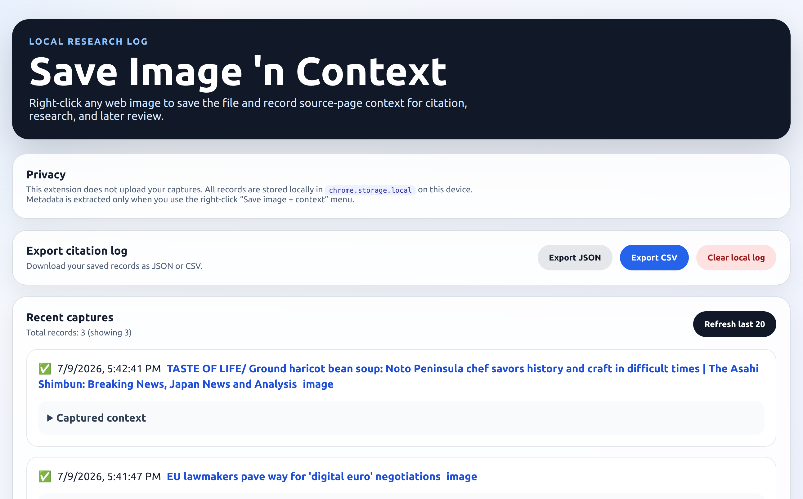

# Save Image 'n Context


A Chrome extension for researchers who save images from the web and need to remember where they came from.

Right-click any image to download it **and** save a local citation record: the source page, image URL, caption, alt text, nearby headings and paragraph text, and page metadata. Everything is stored locally in your browser — nothing is ever uploaded.



## Who it's for

Anyone who collects images and later needs to cite, verify, or trace them: academics, archivists, lawyers, journalists, artists, and students.

## Features

**Captured with every image**

- Image metadata: image URL, alt text, title, aria-label, figure caption, referrer policy
- Page metadata: page URL and title, canonical URL, hostname, meta description, Open Graph title and description
- Semantic context: nearest heading, nearest paragraph, enclosing link URL and text

**Managing your log**

- Options page with your recent captures and their captured context
- Export the full log as JSON or CSV (Excel-safe)
- Clear the local log at any time
- Stores up to 5,000 records in `chrome.storage.local`

**Reliability**

- Automatic content-script injection with retry
- Duplicate-capture detection
- Fallback record when page context can't be extracted (the image still downloads)
- Badge feedback on every capture

## Privacy

This extension does not upload your captures. All records are stored locally in `chrome.storage.local` on your device. Metadata is extracted only when you use the right-click menu — never in the background. There are no analytics, no telemetry, and no network requests.

Full policy: [privacy-policy.html](docs/privacy-policy.html)

## Installation

### From the Chrome Web Store

Coming soon.

### From source

1. Clone this repository:

   ```bash
   git clone https://github.com/nina-mir/save-image-n-context.git
   ```

2. Open `chrome://extensions` in Chrome.
3. Enable **Developer mode**.
4. Click **Load unpacked** and select the `extension/` folder.

## Usage

1. Right-click any image on a webpage.
2. Choose **Save image + context**.
3. The image downloads and a citation record is saved locally.
4. Open the extension's options page to review, export, or clear your log.

A green ✓ badge means the image and full page context were captured. An amber ! badge means the image was saved but page context could not be fully captured (for example, on restricted pages).

## Permissions

| Permission | Why it is needed |
| --- | --- |
| `contextMenus` | Adds the right-click "Save image + context" menu item. |
| `downloads` | Saves the selected image and your JSON/CSV exports. |
| `storage` | Stores citation records locally in your browser. |
| `scripting` | Injects the metadata-extraction script when you use the menu. |
| `<all_urls>` (host access) | Lets the extraction script run on whatever page you invoke it from. It runs only when you use the right-click menu. |

## Repository structure

```text
extension/       The extension itself — the only folder that ships
store-assets/    Chrome Web Store listing material (not shipped)
docs/            Hosted privacy policy (GitHub Pages)
scripts/         Packaging helper
```

## Development

There is no build step — the extension is plain JavaScript. Edit files under `extension/`, then reload the extension at `chrome://extensions`.

To package for the Web Store:

```bash
./scripts/package.sh
```

See [CHANGELOG.md](CHANGELOG.md) for release history.

## Known limitations

- Metadata quality depends on the source website's markup.
- CSS background images are not supported.
- Semantic extraction uses deterministic DOM heuristics, not AI.
- Records are local to the current Chrome profile and do not sync.

## Roadmap

- Search and filtering
- Editable notes on records
- Thumbnail previews
- Citation export formats (APA, MLA, Chicago)

## License

See [LICENSE](LICENSE).
